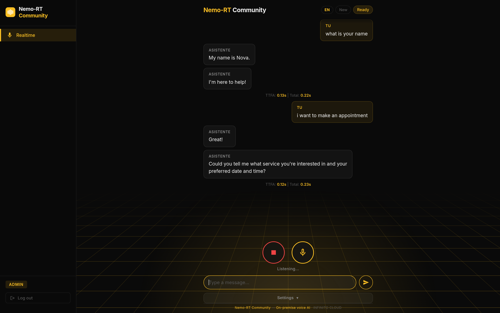
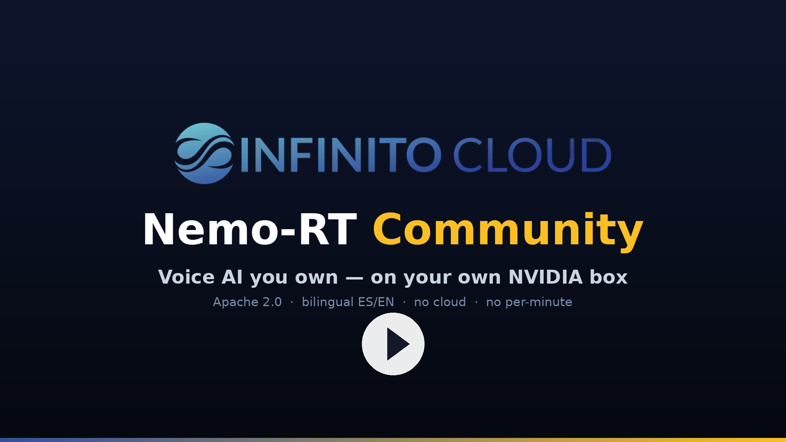

# Nemo-RT Community

### A fully self-hosted, drop-in replacement for cloud voice APIs.

Real-time, **sub-second**, **bilingual ES/EN** voice AI on **your own NVIDIA box** — a
caller speaks, it transcribes, thinks, and speaks back in the same language.
Point any OpenAI Realtime client, SDK or Asterisk/SIP bridge at your box and it works
**unchanged**. **No per-minute fees. No audio leaving your machine. No switch anyone
else can flip.**

**Apache 2.0. Free. Single-tenant. Truly on-premise.**

[](LICENSE)
[](https://www.nvidia.com/en-us/startups/)
[](https://infinitocloud.com)



<sub>The bundled web UI — talk to your on-prem agent from the browser, or drive it
headless over the OpenAI Realtime API.</sub>

---

## Why

Today, if you want a voice assistant for your business, you rent it — metered by
the minute, routed through someone else's cloud, your customers' words logged by a
company that isn't you. And one government letter on a Friday afternoon can switch
it off by Monday. We think that's backwards: your voice AI should be **yours** —
your hardware, your walls, no meter, no switch anyone else can flip. That's why
this exists.

<sub>Longer version → [manifesto](MANIFESTO.md) · [español](MANIFESTO.es.md)</sub>

---

## Truly local — verify it yourself

Every model — **STT, LLM, and TTS** — runs **inside the container, on your GPU**.
No inference call ever leaves the machine. Pull the network cable and it keeps
working.

That matters because a lot of "self-hosted" voice tools only self-host the *app*
— the speech and the language model still phone home to the vendor's cloud, and
your callers' audio goes with them. Nemo-RT doesn't. The brain is on your box,
and it's yours.

---

## Drop-in for the OpenAI Realtime API

Nemo-RT ships a `/v1/realtime` WebSocket endpoint that speaks the OpenAI Realtime
protocol — point any OpenAI Realtime client, SDK or Asterisk/SIP bridge at your box
and it works **unchanged**. Switching from the cloud is a **one-line URL change**:

```diff
- wss://api.openai.com/v1/realtime      # OpenAI cloud, metered
+ ws://<your-box>:8000/v1/realtime       # your GPU, on-prem, free
  Authorization: Bearer <your API key>
```

- **Telephony:** a ready-to-run Asterisk/SIP bridge ships in
  [`integrations/asterisk/`](integrations/asterisk/) — validated on a live call, with barge-in.
- **Clients:** [`examples/`](examples/) has Python + Node clients (the same script hits
  your box or OpenAI); the bundled web UI is just another Realtime client too.

<sub>Speaks the GA event shape (`session.update`, server-VAD, `response.output_audio.delta`,
barge-in via `speech_started` + `response.cancel`) · formats pcmu / pcm / pcma · roadmap:
more provider APIs (e.g. Gemini Live), strict resource IDs.</sub>

---

## Who it's for

If you already **pay per-minute for cloud voice AI** — a contact center, an
outbound / appointment-setting agency, or a team building voice products on
Vapi/Retell/OpenAI — and the bill grows with every call, this runs the **same
workload on hardware you own**. Bring a GPU, run one command.

---

## Runs on a single NVIDIA box

Lead with a **desktop**, not a data center:

| Box | Approx. cost | Concurrent calls* |
|---|---|---|
| **RTX 4090** (consumer, 24GB) | ~$1.6K | dev / small setups ✅ |
| **NVIDIA DGX Spark** (desktop, 128GB unified) | ~$4K | ~20 |
| **H100 / H200** (data-center card) | ~$30K | ~75 |

<sub>*Sub-second TTFA. With ~10:1 overbooking a single Spark provisions ~200 lines.
Scales linearly with more GPUs. The **RTX 4090 is validated** (full stack fits in ~21.5/24 GB,
live voice TTFA 0.17–0.59 s) — great for dev and small deployments; tight VRAM caps concurrent
volume, so the Spark is the better production desktop. See **[HARDWARE.md](HARDWARE.md)**.</sub>

<sub>Needs an **FP8-capable** GPU (Ada / Hopper / Blackwell — not Ampere). Full
compatibility + tested GPUs → **[HARDWARE.md](HARDWARE.md)** (community-built — [add
yours](HARDWARE.md#report-your-result-)).</sub>

One small NVIDIA box on your desk runs a private, bilingual voice agent. That's
the whole idea.

---

## Quick start — one command

On a fresh NVIDIA box, this installs the driver (if missing), Docker, the
toolkit, pulls the image, and launches the agent:

```bash
git clone https://github.com/infinitocloud/nemo-rt-community.git
cd nemo-rt-community
chmod +x setup.sh && ./setup.sh
```

It auto-generates an API key and downloads the models on first run (~10GB — the
default **Qwen3-8B-FP8** is a public model, no token needed); later restarts take
~30s. When it finishes:

```
Web UI : http://<host>:8000/
API key: sk-...
```

Health check:

```bash
curl http://localhost:8000/health     # {"ready": true, "models": {...}}
```

### Try it in the browser

`setup.sh` serves a web UI at `http://<host>:8000/`. The browser microphone needs
**HTTPS**, so open it one of two ways:

```bash
# A) free instant HTTPS (Cloudflare quick tunnel) — easiest, prints an https URL:
SSL_TUNNEL=1 ./setup.sh

# B) fully local, over SSH — keep it on localhost (localhost is exempt from the HTTPS rule):
ssh -L 8000:localhost:8000 user@<host>      # then open http://localhost:8000
```

Then:

1. Open the URL → paste the **API key** `setup.sh` printed → **Connect**.
2. Click the **mic button** (*Tap to connect*) and just talk — it replies in your
   language, sub-second. No mic? Type a message to test the loop.
3. **Barge-in works:** start talking while it speaks and it stops to listen.

<sub>Prefer a TLS reverse proxy (nginx/Caddy) on your own domain for a permanent
HTTPS URL.</sub>

### Talk to it without a browser — no HTTPS needed

The HTTPS note above is **only for the browser microphone**. Any *server-to-server*
client — the example clients, an SDK, or an Asterisk/SIP bridge — connects to the
plain **`ws://`** endpoint directly. No TLS, no Cloudflare, no tunnel required:

```bash
# On the box itself (or after an SSH port-forward — see below):
REALTIME_URL="ws://localhost:8000/v1/realtime" API_KEY="<your key>" \
  python examples/python_realtime_client.py "Hola, ¿qué es el universo?"
# → streams the spoken reply to reply.wav
```

**From another machine**, either point straight at `ws://<box-ip>:8000/v1/realtime`
(same LAN / private network), or forward the port over SSH and keep using
`localhost` — no public URL, audio stays on the wire between the two hosts:

```bash
ssh -L 8000:localhost:8000 user@<box>     # then use ws://localhost:8000/v1/realtime
```

**Telephony:** point the bundled [`integrations/asterisk/`](integrations/asterisk/)
bridge (or any OpenAI-Realtime SIP bridge) at that same `ws://…/v1/realtime` URL.
*Validated end-to-end: a live SIP call answered, transcribed and spoken back on a
single GPU, with barge-in* — the SSL/Cloudflare tunnel is for the browser mic only;
a SIP call never touches it.

## See it in action

[](https://youtu.be/Ltr6j-ucodo)

*From a bare NVIDIA box to a private, bilingual voice agent — one command. ▶ [Watch the 44s demo](https://youtu.be/Ltr6j-ucodo)*

---

## Under the hood

```
Endpoints: /ws            (Nemo native protocol)
           /v1/realtime   (OpenAI Realtime protocol, drop-in)
             ↓ the browser UI speaks either (toggle in Settings) · both feed one core ↓
Pipeline:  audio → VAD → STT (NeMo Conformer, lang-detect)
                     → LLM (Qwen3-8B-FP8, vLLM)
                     → TTS (NeMo FastPitch + HiFi-GAN) → audio out
```

VAD gates speech → STT transcribes and detects language → the LLM replies in that
language → TTS streams audio back, sentence by sentence. The `/v1/realtime`
endpoint is a thin translation layer over this same core. The system prompt is
bilingual and language-adaptive; override it per-session from the Realtime
**Settings** panel.

**Requirements (short version):** an FP8-capable NVIDIA GPU (Blackwell / Hopper /
Ada) — the default **Qwen3-8B-FP8** needs only **~12GB VRAM**, so it runs on a
modest GPU (including a DGX Spark) — Docker, and **~40GB disk** (~24GB first-run
download: ~14GB image + ~10GB model). `setup.sh`
handles the rest.

📖 **Configuration:** every env var is documented in [`.env.example`](.env.example);
`docker-compose.yml` and `setup.sh` show the full run. Questions? Open a thread in
[Discussions](https://github.com/infinitocloud/nemo-rt-community/discussions).

---

## Community vs Pro

| | Community (this repo) | [Pro](https://infinitocloud.com/solutions/nemo-rt-pro) |
|---|:--:|:--:|
| Real-time voice loop (VAD·STT·LLM·TTS) | ✅ | ✅ |
| Bilingual ES/EN, language-adaptive | ✅ | ✅ |
| Self-host on your NVIDIA GPU | ✅ | ✅ |
| **OpenAI Realtime API** compatible (`/v1/realtime`) | ✅ | ✅ |
| **Single-tenant** | ✅ | ✅ |
| **Multi-tenant** (isolate many clients) | — | ✅ |
| **MCP tools** (booking, transfers, CRM) | — | ✅ |
| **RAG** knowledge base | — | ✅ |
| **Dashboard** / analytics / reports | — | ✅ |
| Cluster mgmt · voice cloning · SLA · support | — | ✅ |

Community is the real-time core — free and self-hostable forever. Pro adds the
multi-tenant platform, integrations and support, and keeps Community free.

**Want it managed, multi-tenant, or with support?**
👉 **[Book a 30-min call](https://calendar.app.google/nRVbjSTkvSrBzekZ7)** ·
[nemo-rt-pro](https://infinitocloud.com/solutions/nemo-rt-pro)

---

## License

[Apache License 2.0](LICENSE) — © INFINITO CLOUD LLC. Clone it. Run it. Make it yours.

Built by [INFINITO CLOUD](https://infinitocloud.com) — on-premise voice AI,
bilingual ES/EN, GPU-native. NVIDIA Inception member.
